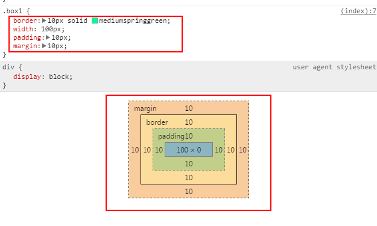
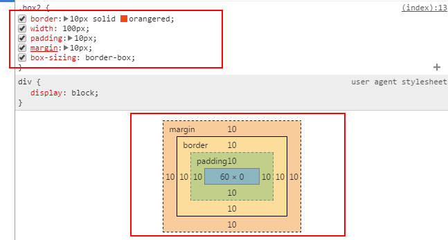

## box-sizing 属性
`box-sizing`属性用于改变盒子模型宽度和高度的计算。

1. 对于默认的盒子模型(`content-box`)来说， margin-left + border-left + padding-left + css设置的宽度 + padding-right + border-right + margin-right = 元素最终的宽度

2. 对于`box-sizing`属性为`border-box'的来说， margin-left + css设置的宽度  + margin-right = 元素最终的宽度
